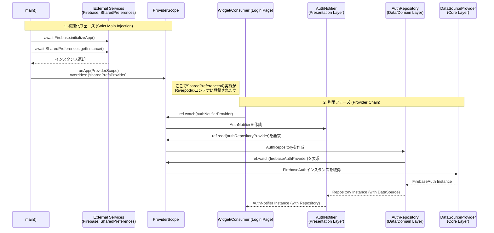

# Logic Flow of Dependency Injection

このシーケンス図は、アプリケーションの起動から、各レイヤー（Presentation, Domain, Data）で依存性がどのように解決・注入されるかを示しています。

## 解説
1.  **初期化 (Main)**:
    *   `main()` 関数内で `Firebase` や `SharedPreferences` などの外部サービスを **await** して確実に初期化します。
    *   初期化したインスタンスは `ProviderScope` の `overrides` を通じてアプリ全体に注入されます。これにより、アプリ内のどこからでも同期的かつ安全にアクセス可能になります。

2.  **依存の解決 (Providers)**:
    *   **UI** は `Notifier` を要求します。
    *   **Notifier** はビジネスロジックを実行するために `Repository` を要求します。
    *   **Repository** はデータ操作を行うために `Data Source (Firebase等)` を要求します。
    *   Riverpodの仕組みにより、これらの依存関係は自動的に解決され、必要なインスタンスが順次第生成・注入されます。
