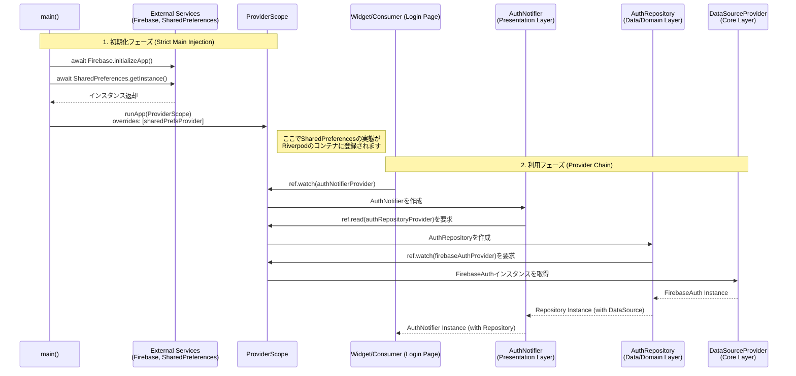

# Logic Flow of Dependency Injection

このシーケンス図は、アプリケーションの起動から、各レイヤー（Presentation, Domain, Data）で依存性がどのように解決・注入されるかを示しています。

## 解説
1.  **初期化 (Main)**:
    *   `main()` 関数内で `Firebase` や `SharedPreferences` などの外部サービスを **await** して確実に初期化します。
    *   初期化したインスタンスは `ProviderScope` の `overrides` を通じてアプリ全体に注入されます。これにより、アプリ内のどこからでも同期的かつ安全にアクセス可能になります。

2.  **依存の解決 (Providers)**:
    *   **UI** は `Notifier` を要求します。
    *   **Notifier** はビジネスロジックを実行するために `Repository` を要求します。
    *   **Repository** はデータ操作を行うために `Data Source (Firebase等)` を要求します。
    *   Riverpodの仕組みにより、これらの依存関係は自動的に解決され、必要なインスタンスが順次生成・注入されます。

---

# アーキテクチャと依存性ルール

本プロジェクトでは、Strict Layered Architectureを採用し、レイヤー間の依存方向を厳格に管理しています。

## 1. レイヤー定義

| レイヤー | ディレクトリ | 役割 | 依存ルール |
| :--- | :--- | :--- | :--- |
| **Domain (ドメイン層)** | `features/*/domain/` | ビジネスロジック、エンティティ、リポジトリのインターフェース定義。 アプリの中核であり、詳細（フレームワークやDB）を知りません。 | **最も内側** 他レイヤー（Data, Presentation）に依存してはならない。 ❌ `import .../data/...` ❌ `import .../presentation/...` |
| **Data (データ層)** | `features/*/data/` | リポジトリの実装、データソース（API, DB）の実装。 外部との通信を担当します。 | Domain層に依存。 Presentation層に依存してはならない。 ⭕️ `import .../domain/...` ❌ `import .../presentation/...` |
| **Presentation (プレゼンテーション層)** | `features/*/presentation/` | UI（画面、ウィジェット）と状態管理（Provider/Notifier）。 ユーザーとの対話を担当します。 | Domain層に依存。 **Data層の実装クラスを直接importしてはならない。** ⭕️ `import .../domain/...` ❌ `import .../data/...` |

## 2. インポートルールの詳細 (Strict Import Rules)

各ファイルの役割に応じた許可/禁止インポートは以下の通りです。このルールは `grep` 等のツールで検証されます。

| ファイルの種類 | パス | 許可されているインポート (⭕️) | 禁止されているインポート (❌) |
| :--- | :--- | :--- | :--- |
| **Entities / UseCases** | `domain/**/*.dart` | `core`, 他機能の `domain` | `data`, `presentation` の全ファイル |
| **Repository Impl** | `data/repositories/*_impl.dart` | `domain`(interface), `data`(datasources) | `presentation` の全ファイル |
| **Screens / Widgets** | `presentation/{screens,widgets}/**/*.dart` | `domain`(entities), `presentation/providers` | **`data` の全ファイル** (RepositoryImpl, DTO, DBなど) |
| **Providers (DI Root)** | `presentation/providers/*.dart` | `domain`, **`data` (実装クラス)**, `core` | - |

> [!IMPORTANT]
> **Data層のimport例外**: `presentation/providers` ディレクトリのみ、**Data層の実装クラス**（`...RepositoryImpl` など）をimportすることが許可されています。これはDI（依存性の注入）の構成を行う「Composition Root」としての役割を担うためです。

## 3. 実装のベストプラクティス

### Provider定義の場所
Repositoryを提供するProviderは、**`data` レイヤーではなく `presentation/providers` レイヤーで定義してください**。

*   **理由**: データ層をRed/Riverpodなどのフレームワークから独立させ、テスト容易性を高めるため。また、Presentation層でどの実装を使うかを決定（構成）できる柔軟性を持つためです。
*   **例**:
    *   ❌ `data/repositories/auth_repository_impl.dart` 内に `@riverpod` でProviderを書く。
    *   ⭕️ `presentation/providers/auth_repository_provider.dart` を作成し、そこで `AuthRepositoryImpl` を返すProviderを書く。

### UIからのデータアクセス
UI（Screen/Widget）の中で、データソースやコントローラーのシングルトンインスタンスを直接呼び出さないでください。

*   ❌ `SearchHistoryController.instance.deleteAll()`
*   ⭕️ `ref.read(searchHistoryControllerProvider).deleteAll()`

必ずRiverpodのProviderを経由することで、テスト時のモック差し替えが可能になり、依存の流れが明確になります。
